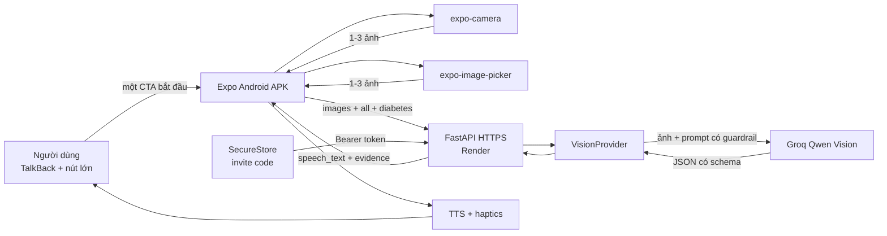

# Kiến trúc MVP — AIVision đọc nhãn và sàng lọc sức khỏe

## 1. Problem brief

- **Người dùng:** người khiếm thị, người thị lực kém và người lớn tuổi dùng Android.
- **Công việc cần làm:** nghe toàn bộ thông tin quan trọng trên nhãn và, khi chủ
  động chọn tiểu đường, biết yếu tố nào cần cân nhắc.
- **Hành vi đích:** chọn hoặc bỏ qua hồ sơ sức khỏe, chụp/chọn tối đa ba ảnh cùng
  sản phẩm, nhận kết quả tiếng Việt có bằng chứng hoặc yêu cầu chụp thêm.
- **Chỉ số chính:** hoàn tất luồng bắt đầu → chụp → nghe kết quả trên thiết bị thật.
- **Guardrail:** không biến NSX thành HSD, không suy đoán thành phần/liều dùng, không
  trả dữ liệu mẫu cho ảnh thật và không khẳng định thực phẩm an toàn khi thiếu
  khẩu phần hoặc tổng carbohydrate.
- **Ngoài phạm vi:** nhận diện chướng ngại vật, dẫn đường, lưu lịch sử ảnh, tài khoản,
  RAG, agent, fine-tuning và speech-to-text trong vertical slice này.

## 2. Quyết định sản phẩm

Ứng dụng chỉ còn một chức năng: **Đọc và phân tích nhãn**. Các nút Hạn sử dụng,
Tên sản phẩm, Thành phần, Hướng dẫn sử dụng và lựa chọn bệnh nền được bỏ khỏi APK
mới vì tạo thao tác trùng lặp. Nút **Bắt đầu đọc nhãn** luôn dùng profile cố định
`requested_field=all` + `health_condition=diabetes`.

Các nút lớn là baseline chính vì ổn định trong EAS APK, có thể được TalkBack đọc và
không phụ thuộc speech recognizer trên từng máy. Điều khiển bằng giọng nói là bước
sau, chỉ thêm khi luồng nút lớn đã được kiểm thử với người dùng thật.

MVP dùng model vision để thực hiện OCR và trích xuất có cấu trúc trong một request.
On-device OCR bằng ML Kit là hướng nâng cấp để giảm chi phí và hỗ trợ offline, không
phải dependency của bản APK hiện tại.

## 3. Sơ đồ hệ thống



## 4. Luồng chính

1. Người dùng nhấn một CTA “Bắt đầu đọc nhãn”; profile tiểu đường được áp dụng tự động.
2. App yêu cầu chụp mặt trước, thành phần và bảng dinh dưỡng.
3. Người dùng thêm tối đa ba ảnh bằng camera, thư viện hoặc kết hợp cả hai; các ảnh
   phải thuộc cùng một sản phẩm.
4. Nút chụp bị khóa cho tới khi `onCameraReady` chạy; thư viện vẫn dùng được khi
   người dùng không cấp quyền camera.
5. App chụp JPEG chất lượng 0.62; lỗi camera tạm thời được thử lại đúng một lần sau
   400 ms và khôi phục kết quả image picker nếu Android hủy Activity.
6. App gửi multipart `images`, `requested_field=all`, `health_condition=diabetes`,
   `locale` và Bearer invite code.
7. API xác thực số ảnh, MIME, signature, kích thước và rate limit trước khi gọi model
   đúng một lần cho cả lượt.
8. Prompt yêu cầu model trích xuất nhãn/bảng dinh dưỡng và kết hợp bằng chứng;
   Pydantic từ chối JSON sai schema.
9. Nếu đánh giá tiểu đường thiếu khẩu phần hoặc tổng carbohydrate, lớp code hậu
   kiểm buộc verdict thành `uncertain`, bất kể model đã trả gì.
10. App đọc `speech_text`, hiển thị verdict, lý do, dữ liệu thiếu và disclaimer.

## 5. API contract

### `POST /v1/analyze-label`

Multipart:

- `images`: lặp lại 1-3 lần, JPEG/PNG/WEBP, tối đa 5 MB mỗi ảnh và 12 MB tổng;
- `image`: một ảnh legacy để tương thích client cũ;
- `requested_field`: `expiry_date`, `product_name`, `ingredients`,
  `usage_instructions` hoặc `all`; APK mới chỉ gửi `all`, giá trị cũ được giữ để
  tương thích client cũ;
- `health_condition`: API để tùy chọn nhằm tương thích client cũ; APK mới luôn gửi `diabetes`;
- `ocr_text`: tùy chọn;
- `locale`: mặc định `vi-VN`.

Response ví dụ:

```json
{
  "success": true,
  "data": {
    "requested_field": "all",
    "image_count": 3,
    "product_type": "food",
    "product_name": "Sản phẩm mẫu",
    "expiry_date": "2027-10-15",
    "ingredients": ["Bột mì", "Đường"],
    "visible_instructions": [],
    "warnings": [],
    "unreadable_fields": [],
    "evidence_text": ["HSD 15/10/2027", "Total carbohydrate 30 g"],
    "nutrition_facts": {
      "serving_size": "1 gói",
      "total_carbohydrate_g": 30,
      "total_sugars_g": 12,
      "added_sugars_g": 10,
      "dietary_fiber_g": 2,
      "sodium_mg": 180
    },
    "health_assessment": {
      "condition": "diabetes",
      "verdict": "limit",
      "summary": "Nên hạn chế và tính 30 g carbohydrate vào kế hoạch bữa ăn.",
      "reasons": ["Nhãn ghi 30 g tổng carbohydrate mỗi khẩu phần."],
      "ingredient_assessments": [
        {"ingredient": "Đường", "verdict": "limit", "reason": "Có thể làm tăng đường huyết."}
      ],
      "missing_information": []
    },
    "confidence": "high",
    "speech_text": "Hạn sử dụng: ngày 15 tháng 10 năm 2027.",
    "request_id": "uuid",
    "provider": "groq",
    "demo_mode": false
  },
  "error": null
}
```

`expiry_date` dùng `YYYY-MM-DD` khi thấy đủ ngày và `YYYY-MM` khi nhãn chỉ có tháng.

## 6. Reliability và quan sát

| Điểm lỗi | Hành vi |
|---|---|
| Camera chưa sẵn sàng | Khóa nút chụp và hiển thị “Đang khởi động camera” |
| Không cấp quyền camera | Vẫn cho chọn nhiều ảnh bằng system photo picker |
| Không có ảnh hoặc quá 3 ảnh | Từ chối deterministic trước khi gọi provider |
| Capture tạm lỗi | Thử lại một lần, sau đó báo lỗi rõ ràng |
| Render cold-start/mạng lỗi | Timeout 90 giây, retry một lần với body mới |
| HTTP 502/503/504 | Retry một lần; không retry 401/413/422/429 |
| Provider timeout | API trả `provider_timeout` cùng request ID |
| Provider trả JSON sai | Log loại lỗi, không log ảnh/OCR/model output; trả `provider_failure` |
| Mục không đọc rõ | Model phải abstain, đưa field vào `unreadable_fields` |
| Model kết luận tích cực nhưng thiếu dữ liệu tiểu đường | Code đổi thành `uncertain` và yêu cầu chụp bảng dinh dưỡng |

Backend log `request_id`, `requested_field`, `image_count`, cờ có/không yêu cầu
đánh giá sức khỏe, provider, latency và loại lỗi. Backend không log bệnh nền cụ
thể, ảnh, invite code, OCR đầy đủ hoặc response model.

## 7. Security và privacy

- `GROQ_API_KEY` chỉ ở Render Environment.
- Invite code thô chỉ ở password manager và Android SecureStore; Render chỉ giữ
  SHA-256 hash và so sánh constant-time.
- APK chỉ chứa URL HTTPS công khai và cờ bật auth.
- Ảnh tồn tại trong bộ nhớ của request, không có database hoặc object storage.
- Bệnh nền chỉ nằm trong request hiện tại; mobile không lưu hồ sơ và backend không
  ghi giá trị bệnh nền vào log.
- `react-native-safe-area-context` sở hữu phần inset; thanh Home nằm ngoài
  `CameraView`, nên status bar Android hoặc camera lifecycle không thể che nút điều hướng.
- Chữ trong ảnh được coi là untrusted data để giảm prompt injection.
- Rate limit theo invite code hợp lệ, theo IP với request chưa xác thực.

## 8. Chi phí và suy giảm

Render Free ngủ sau thời gian idle; request đầu có thể chậm. Retry có giới hạn giúp
phục hồi nhưng không bảo đảm SLA. Groq model hiện là preview và có quota; adapter
giữ vendor boundary để có thể đổi provider. Khi cần production ổn định, dùng compute
always-on, managed rate limit và monitoring.

## 9. Evaluation và release gate

- Unit/API tests kiểm tra compatibility của `requested_field`, 1-3 ảnh, giới hạn
  ảnh, health condition, guardrail thiếu dữ liệu, auth, upload và provider contract.
- Fixture evaluation chỉ gồm label targets; không còn scene/hazard cases.
- Release APK chỉ đạt khi thử trên Android thật với nhãn đầy đủ, thiếu bảng dinh
  dưỡng, đường cao/thấp và ảnh mờ; kết quả phải liên quan ảnh, `provider=groq`,
  `demo_mode=false`, đồng thời thiếu dữ liệu phải trả `uncertain`.
- TalkBack, autofocus, camera lifecycle và cold-start phải được kiểm tra trên ít
  nhất hai thiết bị trước khi gọi là ổn định.
