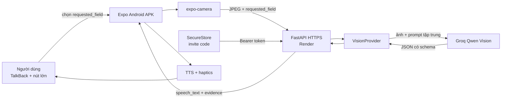

# Kiến trúc MVP — Đôi Mắt AI đọc nhãn theo mục tiêu

## 1. Problem brief

- **Người dùng:** người khiếm thị, người thị lực kém và người lớn tuổi dùng Android.
- **Công việc cần làm:** nghe đúng một thông tin trên nhãn mà không phải nghe toàn
  bộ nội dung dài.
- **Hành vi đích:** chọn mục cần đọc, chụp một ảnh, nhận một câu trả lời tiếng Việt
  ngắn có bằng chứng hoặc yêu cầu chụp lại.
- **Chỉ số chính:** hoàn tất luồng chọn mục → chụp → nghe kết quả trên thiết bị thật.
- **Guardrail:** không biến NSX thành HSD, không suy đoán thành phần/liều dùng, không
  trả dữ liệu mẫu cho ảnh thật.
- **Ngoài phạm vi:** nhận diện chướng ngại vật, dẫn đường, lưu lịch sử ảnh, tài khoản,
  RAG, agent, fine-tuning và speech-to-text trong vertical slice này.

## 2. Quyết định sản phẩm

Ứng dụng chỉ còn một chức năng: đọc nhãn. Trước khi camera mở, người dùng chọn:

1. Hạn sử dụng.
2. Tên sản phẩm.
3. Thành phần.
4. Hướng dẫn sử dụng.
5. Đọc tất cả.

Các nút lớn là baseline chính vì ổn định trong EAS APK, có thể được TalkBack đọc và
không phụ thuộc speech recognizer trên từng máy. Điều khiển bằng giọng nói là bước
sau, chỉ thêm khi luồng nút lớn đã được kiểm thử với người dùng thật.

MVP dùng model vision để thực hiện OCR và trích xuất có cấu trúc trong một request.
On-device OCR bằng ML Kit là hướng nâng cấp để giảm chi phí và hỗ trợ offline, không
phải dependency của bản APK hiện tại.

## 3. Sơ đồ hệ thống



## 4. Luồng chính

1. Người dùng chọn một `requested_field`.
2. App hiển thị hướng dẫn căn đúng vùng chữ cho mục đó.
3. Nút chụp bị khóa cho tới khi `onCameraReady` chạy.
4. App chụp JPEG chất lượng 0.62; lỗi camera tạm thời được thử lại đúng một lần sau
   400 ms.
5. App gửi multipart `image`, `requested_field`, `locale` và Bearer invite code.
6. API xác thực mã, MIME, signature, kích thước và rate limit trước khi gọi model.
7. Prompt yêu cầu model chỉ trả mục đã chọn; Pydantic từ chối JSON sai schema.
8. App đọc `speech_text`, hiển thị bằng chứng và cho phép chụp lại cùng mục.

## 5. API contract

### `POST /v1/analyze-label`

Multipart:

- `image`: JPEG/PNG/WEBP, tối đa 5 MB;
- `requested_field`: `expiry_date`, `product_name`, `ingredients`,
  `usage_instructions` hoặc `all`; mặc định `all` để tương thích client cũ;
- `ocr_text`: tùy chọn;
- `locale`: mặc định `vi-VN`.

Response ví dụ:

```json
{
  "success": true,
  "data": {
    "requested_field": "expiry_date",
    "product_type": null,
    "product_name": null,
    "expiry_date": "2027-10-15",
    "ingredients": [],
    "visible_instructions": [],
    "warnings": [],
    "unreadable_fields": [],
    "evidence_text": ["HSD 15/10/2027"],
    "confidence": "high",
    "speech_text": "Hạn sử dụng: ngày 15 tháng 10 năm 2027.",
    "request_id": "uuid",
    "provider": "groq",
    "demo_mode": false
  },
  "error": null
}
```

`expiry_date` dùng `YYYY-MM-DD` khi thấy đủ ngày và `YYYY-MM` khi nhãn chỉ có tháng.

## 6. Reliability và quan sát

| Điểm lỗi | Hành vi |
|---|---|
| Camera chưa sẵn sàng | Khóa nút chụp và hiển thị “Đang khởi động camera” |
| Capture tạm lỗi | Thử lại một lần, sau đó báo lỗi rõ ràng |
| Render cold-start/mạng lỗi | Timeout 90 giây, retry một lần với body mới |
| HTTP 502/503/504 | Retry một lần; không retry 401/413/422/429 |
| Provider timeout | API trả `provider_timeout` cùng request ID |
| Provider trả JSON sai | Log loại lỗi, không log ảnh/OCR/model output; trả `provider_failure` |
| Mục không đọc rõ | Model phải abstain, đưa field vào `unreadable_fields` |

Backend log `request_id`, `requested_field`, provider, latency và loại lỗi. Backend
không log ảnh, invite code, OCR đầy đủ hoặc response model.

## 7. Security và privacy

- `GROQ_API_KEY` chỉ ở Render Environment.
- Invite code thô chỉ ở password manager và Android SecureStore; Render chỉ giữ
  SHA-256 hash và so sánh constant-time.
- APK chỉ chứa URL HTTPS công khai và cờ bật auth.
- Ảnh tồn tại trong bộ nhớ của request, không có database hoặc object storage.
- Chữ trong ảnh được coi là untrusted data để giảm prompt injection.
- Rate limit theo invite code hợp lệ, theo IP với request chưa xác thực.

## 8. Chi phí và suy giảm

Render Free ngủ sau thời gian idle; request đầu có thể chậm. Retry có giới hạn giúp
phục hồi nhưng không bảo đảm SLA. Groq model hiện là preview và có quota; adapter
giữ vendor boundary để có thể đổi provider. Khi cần production ổn định, dùng compute
always-on, managed rate limit và monitoring.

## 9. Evaluation và release gate

- Unit/API tests kiểm tra từng `requested_field`, invalid target, auth, upload và
  provider contract.
- Fixture evaluation chỉ gồm label targets; không còn scene/hazard cases.
- Release APK chỉ đạt khi thử trên Android thật với ít nhất: HSD rõ, HSD mờ, tên
  sản phẩm, thành phần và hướng dẫn; kết quả phải liên quan ảnh, `provider=groq`,
  `demo_mode=false`.
- TalkBack, autofocus, camera lifecycle và cold-start phải được kiểm tra trên ít
  nhất hai thiết bị trước khi gọi là ổn định.
