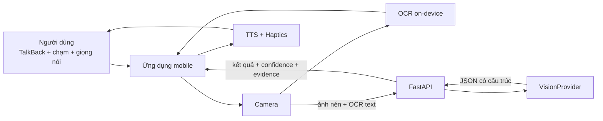

# Kiến trúc dự án Đôi Mắt AI

## 1. Problem brief

### Người dùng

- Người khiếm thị hoặc thị lực kém cần tự đọc nhãn và nhận biết môi trường trong nhà.
- Người lớn tuổi khó đọc chữ nhỏ, khó thao tác với giao diện nhiều bước.
- Người thân hoặc người chăm sóc cần một công cụ hỗ trợ đơn giản, chi phí thấp.

### Kết quả mong muốn

Người dùng có thể lấy đúng vật phẩm và đọc được thông tin quan trọng trên nhãn mà ít phụ thuộc hơn vào người khác. Khi quét môi trường, người dùng nhận được cảnh báo sớm về một số nguy cơ đã định nghĩa.

### Giả định cần kiểm chứng

1. Camera điện thoại phổ thông chụp nhãn đủ rõ trong điều kiện trong nhà.
2. OCR tiếng Việt đọc được tên sản phẩm, ngày tháng và dòng hướng dẫn trên bao bì thực tế.
3. Phản hồi bằng giọng nói và rung dễ hiểu khi TalkBack đang hoạt động.
4. Độ trễ của phân tích ảnh qua mạng vẫn chấp nhận được cho đọc nhãn.
5. Cảnh báo cảnh vật theo ảnh lấy mẫu có giá trị dù không phải hệ thống dẫn đường thời gian thực.

### Chỉ số MVP

- Ít nhất 8/10 ảnh demo đọc đúng tên sản phẩm hoặc loại vật phẩm.
- Ít nhất 8/10 ngày hết hạn nhìn rõ được trích xuất đúng; nếu không rõ phải từ chối thay vì đoán.
- Thời gian từ lúc chụp đến lúc bắt đầu đọc kết quả: mục tiêu dưới 5 giây trên mạng demo.
- 100% kết quả thuốc phân biệt rõ chữ nhìn thấy với phần không xác định.
- 100% tác vụ chính sử dụng được với TalkBack và có nút chạm tối thiểu 48 dp.
- Cảnh báo Thám hiểm không lặp quá dày và luôn có cách dừng ngay.

## 2. Quyết định phạm vi

### Có trong MVP

- Chụp một ảnh và hướng dẫn căn camera bằng âm thanh ngắn.
- OCR chữ tiếng Việt/Latin trên thiết bị khi tích hợp khả thi.
- Phân tích ảnh bằng vision provider qua backend để nhận diện vật phẩm và cấu trúc nội dung.
- Đọc kết quả bằng TTS tiếng Việt.
- Quét cảnh theo nhịp 2–3 giây, cảnh báo tập nguy cơ giới hạn.
- Rung theo mức cảnh báo.
- Chế độ demo fixture được gắn nhãn rõ khi không có API key.
- Không lưu ảnh mặc định; log chỉ chứa thời gian, độ trễ, mã lỗi và loại kết quả.

### Không có trong MVP

- Dẫn đường tự động hoặc cam kết tránh va chạm.
- Đo khoảng cách chính xác bằng một camera RGB.
- Khẳng định một người đang tiến đến gần khi chưa có tracking/depth.
- Chẩn đoán y tế, đề xuất liều dùng hoặc diễn giải đơn thuốc.
- Nhận diện mọi sản phẩm trên thị trường.
- Tài khoản, mạng xã hội, lịch sử ảnh hoặc vector database.

## 3. Lựa chọn công nghệ

| Thành phần | MVP | Lý do |
|---|---|---|
| Mobile | React Native + Expo development build + TypeScript | Một codebase, camera/TTS/haptics sẵn có, phù hợp hackathon |
| Camera | `expo-camera` | Capture ảnh và preview đơn giản |
| Giọng nói | `expo-speech`, locale `vi-VN` | TTS cục bộ, không cần backend âm thanh |
| Rung | `expo-haptics` | Phản hồi tactile đa nền tảng |
| Trợ năng | React Native accessibility API, kiểm thử TalkBack | Nhãn, role, state, live announcement và focus |
| OCR | ML Kit Text Recognition v2 qua native adapter khi có; server/provider fallback | OCR Latin hỗ trợ tiếng Việt và có thể chạy on-device |
| Backend | FastAPI + Pydantic | API nhỏ, validation rõ, sinh OpenAPI |
| Hiểu ảnh | Adapter `VisionProvider` thay thế được | Không khóa nhà cung cấp; trả JSON có schema |
| Lưu trữ | Không có database trong MVP | Giảm phạm vi và rủi ro dữ liệu |
| Kiểm thử | Vitest/Jest phía mobile, pytest phía API, bộ ảnh eval nhỏ | Chứng minh hành vi cốt lõi |

Không dùng agent, RAG hoặc fine-tuning trong MVP vì luồng xử lý cố định và không có kho tri thức cần truy hồi.

## 4. Sơ đồ hệ thống



## 5. Luồng đọc nhãn

1. Người dùng chọn “Đọc nhãn”.
2. Ứng dụng thông báo “Đưa nhãn vào giữa camera” và cho phép chụp bằng nút lớn.
3. Mobile kiểm tra ảnh tối, rung hoặc mờ ở mức cơ bản. Nếu không đạt, yêu cầu chụp lại.
4. OCR trích xuất chữ nhìn thấy. Ảnh nén và OCR text được gửi tới `POST /v1/analyze-label`.
5. Vision provider chỉ cấu trúc hóa thông tin có bằng chứng:
   - loại hoặc tên sản phẩm;
   - hạn sử dụng;
   - hướng dẫn nhìn thấy trên nhãn;
   - cảnh báo;
   - phần chưa đọc rõ.
6. Backend validate schema, loại bỏ câu vượt quá bằng chứng và trả kết quả.
7. Mobile hiển thị chữ lớn, đọc bản tóm tắt và cho phép “Đọc lại”, “Đọc toàn bộ chữ”, “Chụp lại”.

### Quy tắc an toàn cho thuốc

- Không suy diễn liều dùng, chống chỉ định hoặc hướng dẫn dùng thuốc.
- Chỉ đọc nội dung thấy rõ trên nhãn.
- Nếu ngày hết hạn mơ hồ, nói “Tôi chưa đọc rõ hạn sử dụng” và yêu cầu chụp lại.
- Nếu sản phẩm có vẻ là thuốc, thêm nhắc nhở kiểm tra với dược sĩ/người chăm sóc khi thông tin quan trọng không rõ.

## 6. Luồng Thám hiểm MVP

1. Người dùng giữ điện thoại hướng về phía trước và bật “Thám hiểm”.
2. Ứng dụng lấy một frame sau mỗi 2–3 giây; không queue frame cũ.
3. Backend trả tối đa ba nguy cơ trong danh sách cho phép:
   - vật cản lớn phía trước;
   - người trong khung hình;
   - bậc thang nhìn thấy;
   - sàn có vùng nghi là ướt;
   - cửa đóng hoặc lối đi bị chắn.
4. Mobile chỉ đọc cảnh báo mới hoặc có mức khẩn cấp tăng. Haptics map theo `info/warning/urgent`.
5. Người dùng có nút “Dừng” luôn hiện diện và hỗ trợ accessibility action.

Đây là phân tích cảnh lấy mẫu, không phải dẫn đường thời gian thực. Không phát biểu khoảng cách hoặc hướng chuyển động nếu pipeline không có cảm biến chiều sâu và tracking qua nhiều frame.

## 7. API contracts

### `POST /v1/analyze-label`

Input multipart:

- `image`: JPEG/PNG/WEBP, tối đa 5 MB;
- `ocr_text`: tùy chọn;
- `locale`: mặc định `vi-VN`.

Response:

```json
{
  "success": true,
  "data": {
    "request_id": "uuid",
    "product_type": "medicine",
    "product_name": "Panadol Extra",
    "expiry_date": "2027-10",
    "visible_instructions": ["Uống sau khi ăn"],
    "warnings": [],
    "unreadable_fields": [],
    "evidence_text": ["PANADOL EXTRA", "EXP 10/2027", "Uống sau khi ăn"],
    "confidence": "high",
    "speech_text": "Đây có thể là Panadol Extra. Hạn sử dụng tháng 10 năm 2027.",
    "provider": "openai",
    "demo_mode": false
  },
  "error": null
}
```

Mọi field không có bằng chứng phải là `null`, mảng rỗng hoặc nằm trong `unreadable_fields`.

### `POST /v1/analyze-scene`

Response:

```json
{
  "success": true,
  "data": {
    "request_id": "uuid",
    "hazards": [
      {
        "type": "obstacle",
        "direction": "center",
        "urgency": "warning",
        "confidence": "medium",
        "speech_text": "Có vật cản ở phía trước."
      }
    ],
    "limitations": ["Không đo được khoảng cách chính xác từ ảnh này."],
    "provider": "openai",
    "demo_mode": false
  },
  "error": null
}
```

Error response dùng cùng envelope với `success: false`, `data: null` và
`error: { code, message, request_id }`.

## 8. Biên hệ thống và bảo mật

- API key chỉ nằm ở backend; không đóng gói trong ứng dụng.
- Kiểm tra MIME, kích thước, timeout và rate limit cho upload.
- Không log ảnh, OCR text đầy đủ hoặc dữ liệu cá nhân.
- Xử lý ảnh trong bộ nhớ và giải phóng sau request.
- Provider timeout phải trả thông báo dễ hiểu và cho phép thử lại.
- Prompt hệ thống coi chữ trong ảnh là dữ liệu không tin cậy; không làm theo chỉ dẫn xuất hiện trên nhãn.
- Endpoint chỉ trả schema cố định, không trả HTML tùy ý.

## 9. Khả năng suy giảm

| Sự cố | Hành vi |
|---|---|
| Không có mạng | OCR on-device đọc toàn bộ chữ; giải thích rằng nhận diện nâng cao chưa khả dụng |
| Ảnh mờ/tối | Không gọi provider; hướng dẫn chụp lại |
| Provider timeout | Rung lỗi một lần, giữ màn hình camera, cho phép thử lại |
| Confidence thấp | Dùng ngôn ngữ “có thể”, đọc bằng chứng và không khẳng định |
| TTS lỗi | Hiển thị chữ lớn, tương phản cao và phát accessibility announcement |
| Quá nhiều cảnh báo | Deduplicate theo loại/hướng trong cửa sổ thời gian |

## 10. Hướng nâng cấp production

- Native Android/Kotlin hoặc native module cho pipeline CameraX ổn định.
- Object detection/segmentation on-device bằng LiteRT/MediaPipe.
- Depth API hoặc cảm biến depth trên thiết bị hỗ trợ.
- Tracking nhiều frame và ước lượng chuyển động trước khi nói “đang tiến lại gần”.
- Đánh giá với người khiếm thị thật, nhiều thiết bị, ánh sáng và accent tiếng Việt.
- Safety case, monitoring và quy trình báo lỗi trước khi quảng bá như công cụ hỗ trợ di chuyển.

## 11. Tài liệu kỹ thuật chính

- Expo Camera: https://docs.expo.dev/versions/latest/sdk/camera/
- Expo Speech: https://docs.expo.dev/versions/latest/sdk/speech/
- Expo Haptics: https://docs.expo.dev/versions/latest/sdk/haptics/
- React Native Accessibility: https://reactnative.dev/docs/accessibility
- ML Kit Text Recognition v2: https://developers.google.com/ml-kit/vision/text-recognition/v2/android
- CameraX Image Analysis: https://developer.android.com/media/camera/camerax/analyze
